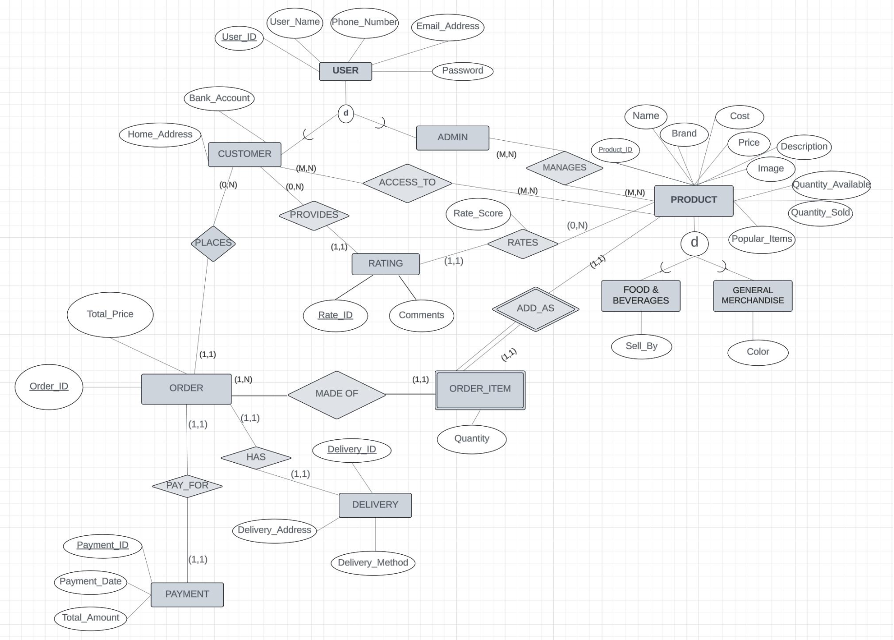

# SV Eshop Registration System Using ChatGPT

## Description

SV E-Shop Registration System Using LLM is an online shopping web application, operated by admin to enhance the shopping experience for students and faculties in Silicon Valley (SV) campus community. This system enables students to browse a wide variety of products, manage their orders, track delivery and complete secure payments. Administrators are provided with tools to efficiently manage the product catalog, track transactions, communicate with students, and oversee overall system operations.

## Enhanced Entity-Relationship

https://storage.googleapis.com/eshop_product_images/EER_Diagram.png

## Relation Model

https://storage.googleapis.com/eshop_product_images/Relation_Model.png

## Relational Algebra

Refer to Database Design folder for 20 relational algebra for this project.

## Installation and Setup

1. Cline the repository from Github.

2. Navigate to project directory and install virtual environment using `pip install virtualenv`.

3. Install and initialize the Cloud SDK using link: https://cloud.google.com/sdk/docs/install . Reconfigure environment using `gcloud init`. Login into gcloud by using `gcloud auth application-default login`.

4. Navigate to project directory and install all the required dependencies using `pip install -r requirements.txt` for Python.

5. Source sample data into Google Cloud SQL Instance by using `source all_ddl.sql;` and `source all_dml.sql;`. 

6. Set up database connection to Google Cloud SQL and configure the database settings in `settings.py`. 

7. Run the commands for migration using `python manage.py makemigrations` and `python manage.py migrate`.

8. Run the project on the development server using `python manage.py runserver`.